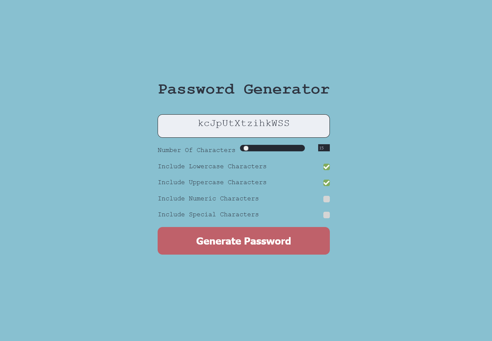

# javascriptPasswordGenerator
A minimalist password generator written in javascript. This application can generate a password following simple parameters.
## Sample 

## Live Link
[Deployed link](https://bashar147258.github.io/javascriptPasswordGenerator/)
## To do list
* Add an entropy tracker so users can gauge how secure their generated password is 
* Add a copy button so users can copy the generated password into their clipboard
* Add an exlusion so users can choose to exclude certian character as required by the service.
